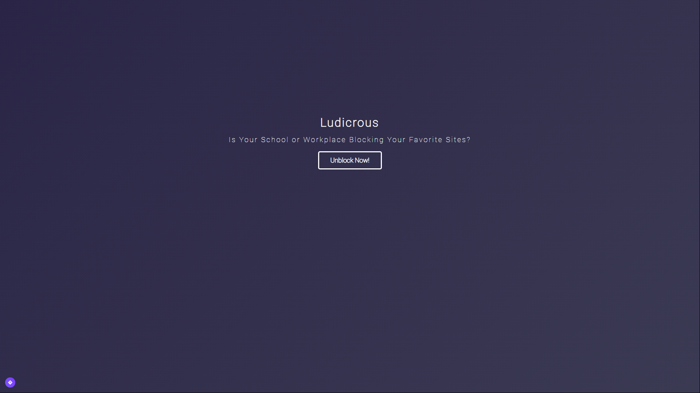

# Ludicrous



Ludicrous Is An Upcoming Web Proxy Site (More Comonly Known As An Unblocker Site) Made By EnderKingJ And Karlee Rae.

[](https://heroku.com/deploy?template=https://github.com/LudicrousDevelopment/LudicrousOfficial/tree/master)
&nbsp;
<a href="https://repl.it/github/LudicrousDevelopment/LudicrousOfficial" title="Run on Repl.it"></a>
&nbsp;
<a href="https://glitch.com/edit/#!/import/github/LudicrousDevelopment/LudicrousOfficial" title="Remix on Glitch"></a>

**Dependencies:**

First, [Install Git](https://git-scm.com/downloads)

Next, Make Sure you Have NPM and [Node (Comes With NPM)](https://nodejs.org/en/) Installed

Lastly, Make Sure to Have Python Installed for Better QOL

And you Should be all set to run Ludicrous!

**Setup:**

First, Clone the Repository
```shell
git clone https://github.com/ludicrousdevelopment/ludicrousofficial
```
Next, CD Into the Repository
```shell
cd ludicrous
```
Thirdly, run NPM
```shell
npm i | npm install
```
*Set Up*
```shell
npm run pstart
```
*Start The Server*
```shell
npm start
```
**Done! Your Server is now Ready at:**
localhost:(whatever port you selected in setup)
